# Loan Approval Prediction System

## Introduction:
This project aims to predict loan approval status using customer and asset data. By applying data science techniques, we analyze key factors influencing loan decisions and build a logistic regression model from scratch. The workflow includes data exploration, preprocessing, visualization, and model evaluation.

---

## Data Description:
The dataset (`loan_approval_dataset.csv`) contains the following columns:
- **no_of_dependents**: Number of dependents
- **education**: Education status (Graduate/Not Graduate)
- **self_employed**: Employment status (Yes/No)
- **income_annum**: Annual income
- **loan_amount**: Requested loan amount
- **loan_term**: Loan term (months)
- **cibil_score**: CIBIL credit score
- **residential_assets_value**: Value of residential assets
- **commercial_assets_value**: Value of commercial assets
- **luxury_assets_value**: Value of luxury assets
- **bank_asset_value**: Value of bank assets
- **loan_status**: Target variable (Approved/Rejected)

---

## Preprocessing:
- **Missing Values**: Checked and handled missing values.
- **Label Encoding**: Converted categorical columns (`education`, `self_employed`, `loan_status`) to numerical values using `LabelEncoder`.
- **Feature Selection**: Selected relevant features for modeling.
- **Scaling**: Standardized numerical features using `StandardScaler`.

---

## Exploratory Data Analysis (EDA):

### 1. Data Overview
- Checked shape, columns, info, and summary statistics.

### 2. Target Variable Distribution
- Visualized the distribution of approved vs rejected loans.
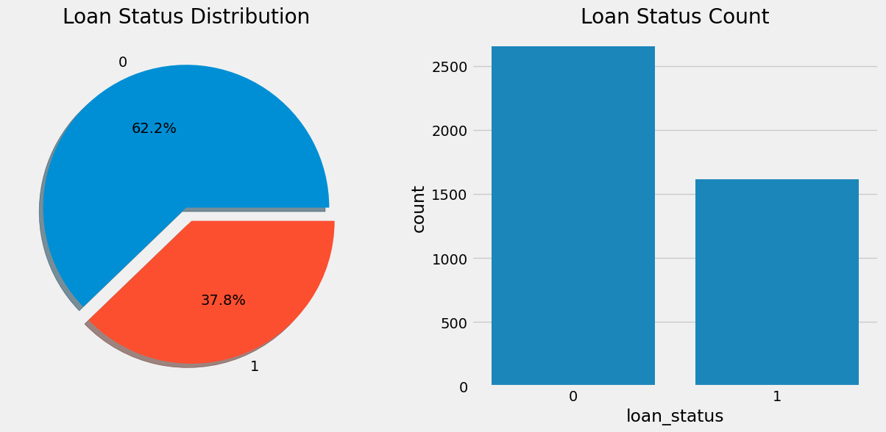

### 3. Categorical Feature Analysis
- Explored how education and employment status affect loan approval.
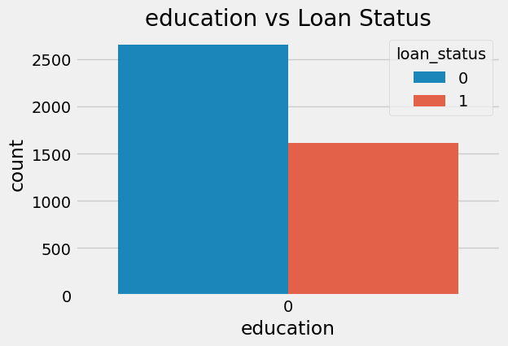
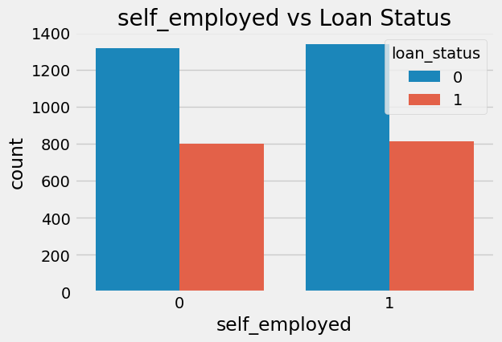

### 4. Numerical Feature Distributions
- Plotted histograms for all numerical features.
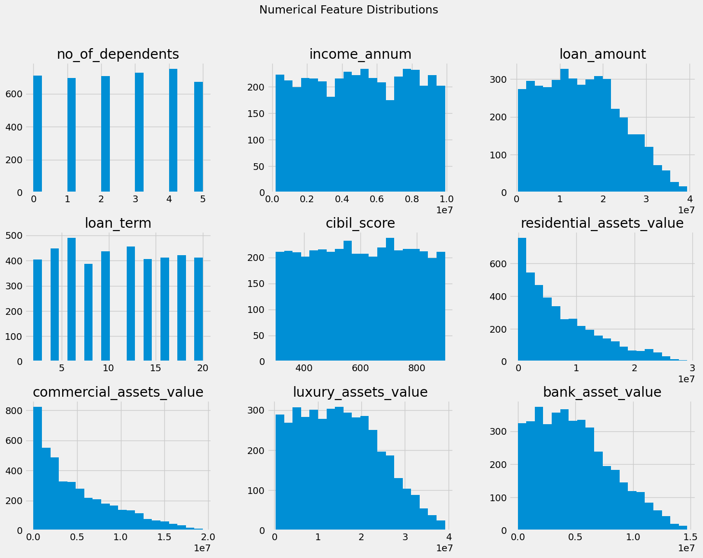

### 5. Boxplots: Numerical Features vs Target
- Compared distributions of numerical features for approved vs rejected loans.
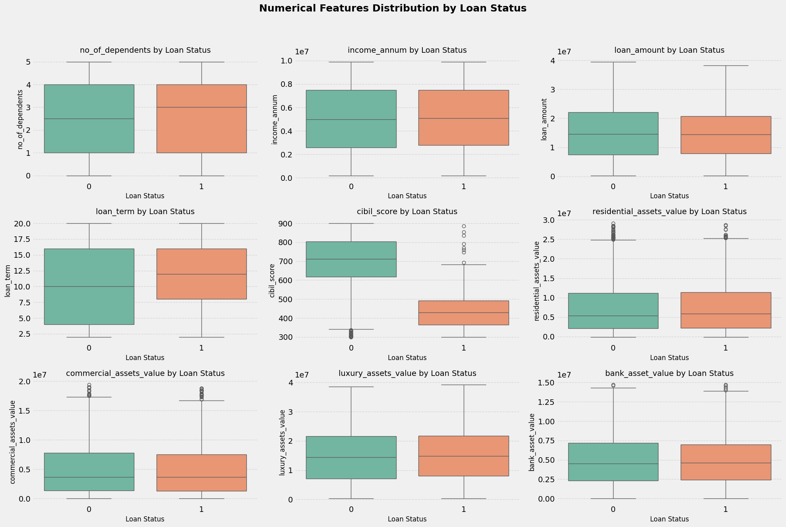

### 6. Correlation Analysis
- Visualized feature correlations.
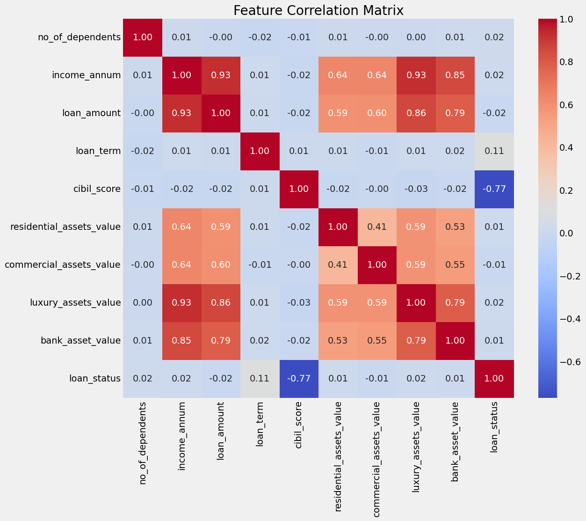

### 7. Scatter Plots: Feature vs Target
- Plotted each feature against the target variable.
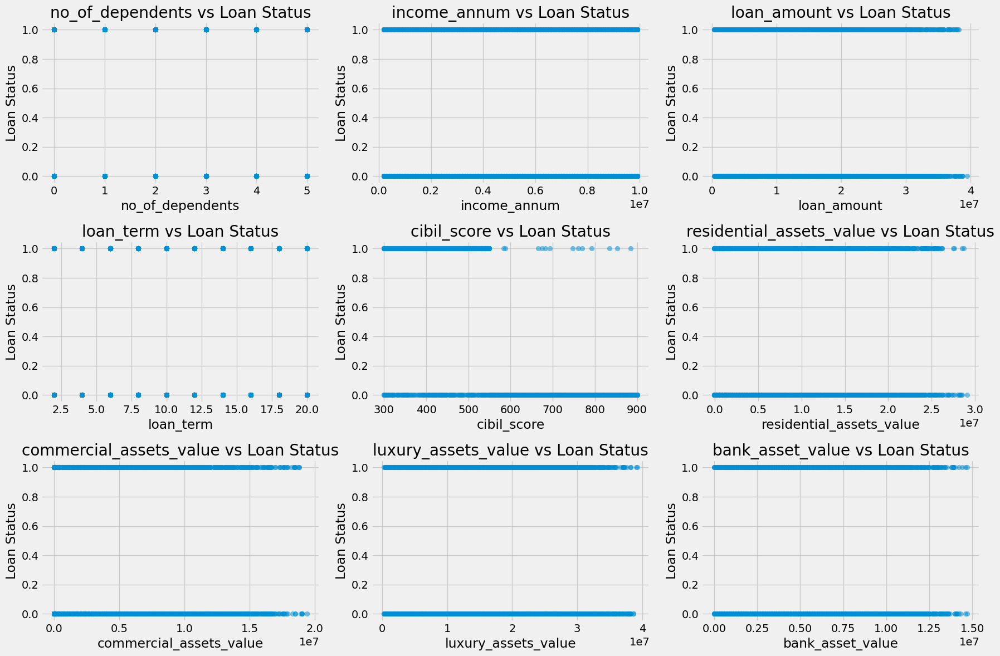

### 8. Pairplot for Feature Interactions
- Explored pairwise relationships between features.
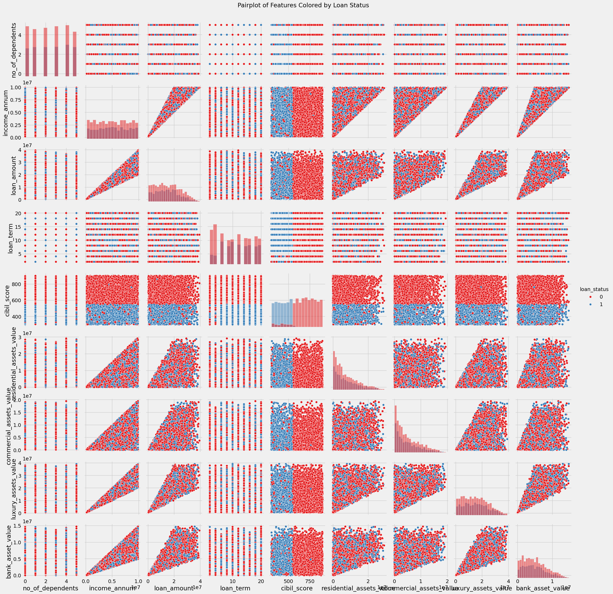

---

## Model:
- Implemented logistic regression from scratch using gradient descent.
- Functions: `sigmoid`, `cost`, `gradient`, `GradientDescent`, `Prediction`.

---

## Model EDA & Plots:
### 1. Cost Function Visualization
- Shows model learning progress.
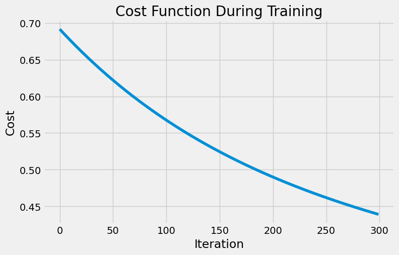

### 2. Prediction Distribution
- Visualizes predicted loan status.
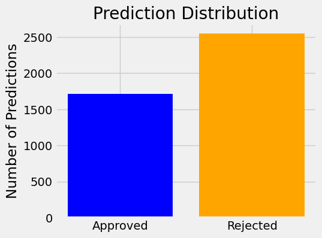

### 3. Model Accuracy
- Shows the proportion of correct vs incorrect predictions.
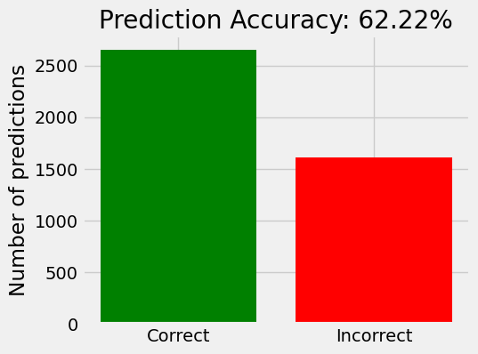

### 4. Confusion Matrix (Optional)
- Evaluates model accuracy.
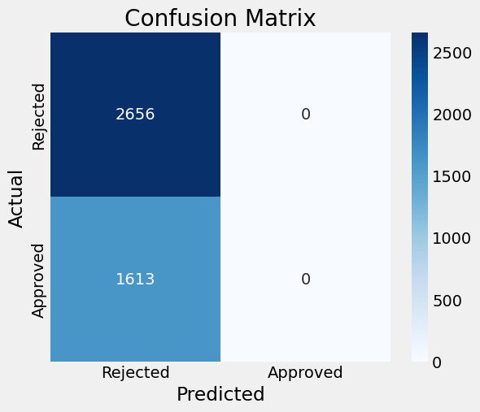
---

## Conclusion:
This project demonstrates a full machine learning workflow for loan approval prediction, including data cleaning, EDA, feature engineering, custom model implementation, and result visualization. The approach provides insights into the factors affecting loan approval and a baseline model